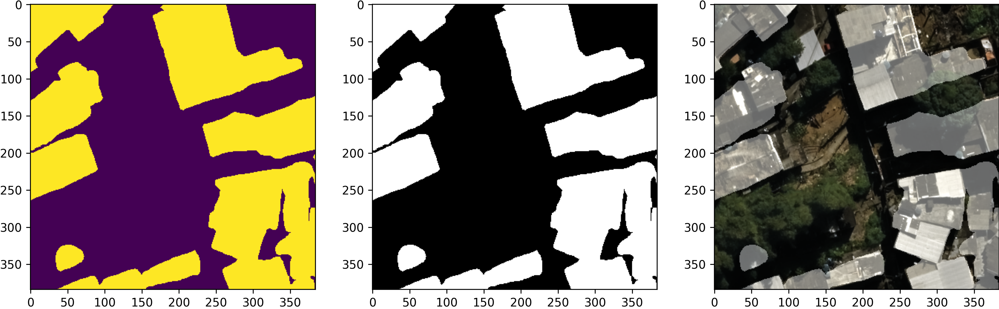
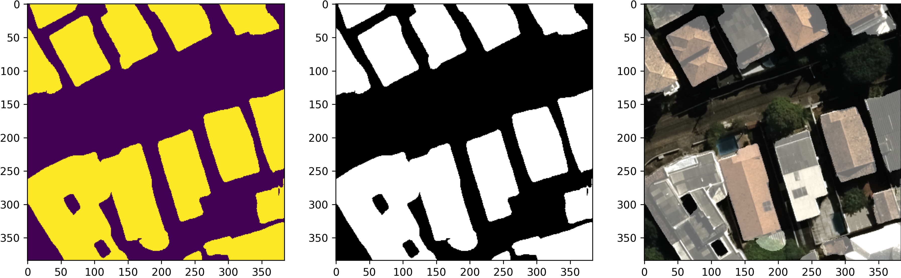
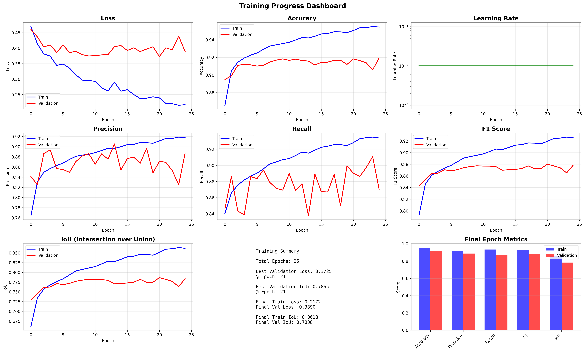



# Building Footprint Segmentation with RefiNet


A deep learning project for segmenting building footprints from aerial/satellite imagery using RefiNet architecture. This project is based on [building-footprint-segmentation](https://github.com/fuzailpalnak/building-footprint-segmentation) with significant modifications and improvements.

## Overview

This project uses advanced segmentation techniques to identify and extract building footprints from overhead imagery, which is useful for urban planning, mapping applications, and geospatial analysis.

## Requirements

-   Python 3.12+
-   CUDA-compatible GPU (NVIDIA) or ROCm-compatible GPU (AMD)
-   Git

### Key Dependencies

-   **PyTorch** (ROCm or CUDA version depending on your GPU)
-   **building-footprint-segmentation** 0.2.4
-   **NumPy** 1.26.4 (specific version required)
-   **albumentations** 2.0.8
-   **opencv-python-headless** 4.11.0.86
-   **torchvision**, **torchaudio**
-   **scikit-learn**, **scipy**
-   **matplotlib**, **Pillow**
-   **Jupyter** (for notebooks)

## Installation

### 1. Clone the Repository

```bash
git clone <[your-repository-url](https://github.com/Daniel-ime/building-footprint-segmentation-resnet50)>
```

### 2. Create Conda Environment

```bash
conda create -n building-seg python=3.12
conda activate building-seg

```

### 3. Install PyTorch

**For AMD GPUs (ROCm):**
Use the specific installation guide from : [ROCm]( https://rocm.docs.amd.com/projects/install-on-linux/en/develop/install/3rd-party/pytorch-install.html) and install the other required packages afterwards.


### 4. Install Other Required Packages

**Critical:** NumPy must be version 1.26.4:

```bash
pip install numpy==1.26.4 albumentations opencv-python-headless scikit-learn scipy matplotlib Pillow jupyter jupyterlab ipywidgets tqdm pyyaml
```


### 5. Install Building Footprint Segmentation
Implementation was done in a way that it is necessary to have the main folder inside your python environment. You can do it by pip install on the right folder as there is a setup.py file. 

```bash
pip install building-footprint-segmentation
```
However if it doesn't work simply copy paste it to the environment folder.
## Usage
### Prediction path
Inference is run by [Inference](examples/Prediction.ipynb) where  the two inputs needed are the 'image to be predicted' file path :
```python
MAX_SIZE  =  384
TRAINED_MODEL  =  ReFineNet()
PRED_PTH  =  r"your/image/path.tif"
```
and the second input needed is the Custom Weights path:
```python
CUSTOM_WEIGHTS  =  r"your/weights/path.pt"
```
There are provided weights in the logs/mass_building_seg folder, and the result images that will be shown afterwards were generated with the finalversionrio_resnet50_batchs16_th.45epch100 best.pt file
### Training path
Training is done through [Training](examples/Run with config.ipynb), inputs are generally in the yaml file, resnet50rio is a great example of that and was the one used in the model showed on the results bellow

```python
config_path  =  r"/home/ippws/building-footprint-segmentation/resnet50rio.yaml"
```
However, lr and weight decay are implemented directly on the optimizer:
```python
optimizer  =  segmentation.load_optimizer(model, name=config["Optimizer"]["name"], lr=  1e-4, weight_decay  =  1e-5)
```
### Results






## Project Structure
For training, the folder structure of the project is very relevant, this is an example of the expected structure from your training data:
```
.
├── data/rio/building_patches/                # Dataset directory, this is the expected
   ├──train/								  # format, other formats wont work.
      ├──images
      ├──labels       
	├──val/
      ├──images
      ├──labels
	├──test/
      ├──images
      ├──labels
```
It is also very relevant to mention that the image and label inputs will be normalized, the results above were normalized with the divided_by_255 function and binary_label functions for the images and labels respectively:
```python
def  divide_by_255(img: np.ndarray) -> np.ndarray:
	return  img  /  255

def  binary_label(mask: np.ndarray) -> np.ndarray:
	mask  =  cv2.cvtColor(mask, cv2.COLOR_RGB2GRAY)
	normalized_mask  = (mask>0).astype(np.uint8)
	if  len(normalized_mask.shape) ==  3:
		normalized_mask  =  normalized_mask[:,:,0]
	return  np.expand_dims(normalized_mask, -1)
```
This means that your label input will be converted to Gray scale and then be forced to become 0 or 1s, if your label is already a binary image you should skip this normalization process. The Rio dataset used had an 8bit image label.

Also images need to be croped to 384,384,3 dimensions so there is a code provided in [Crop](newcodes/crop.py) that will do that, just change the inputs to your original image size:
```python
ORIGINAL_DIM_OF_IMAGE  = (15899, 21817, 3) # put your size here
```
And finally threshold changes must be done directly in [Metrics](building_footprint_segmentation/helpers/metrics.py):
```python
class  BinaryMetric(MetricList):
	def  __init__(self, metrics: list):
		super().__init__(metrics)
		self._activation  =  "sigmoid"
		self._threshold  =  0.45

	def  metric_activation(self, prediction):
		prediction  =  prediction.sigmoid()
		prediction[prediction  >=  self._threshold] =  1
		prediction[prediction  <  self._threshold] =  0
		return  prediction
```
## Modifications from Original

This project includes significant changes and improvements over the [original repository](https://github.com/fuzailpalnak/building-footprint-segmentation), including:

-   weight decay implementation and learning rate fix
-   Resnet50 backbone was used instead of 34
-   Fixed normalization issues for non completely white labels 
-   Fixed normalization issues for inference 
-  implemented AuC curve generation and general trainning curves generation without the need of tensorboard

## Acknowledgments

Based on the work by [fuzailpalnak](https://github.com/fuzailpalnak/building-footprint-segmentation).

Hardware provided by Instituto Municipal de Urbanismo Pereira Passos - IPP


## Contact
You can contact me at santana.daniel@ime.eb.br

